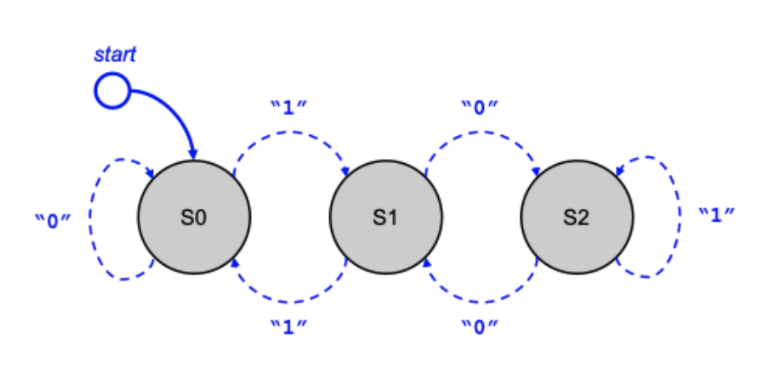

# Software Developer - Technical Assignment
Please complete the assignments below in the language of your choice. Put the solution for each assignment in a separate folder, organize your code at a production level and make sure your code is well tested. Please refer to the provided rubric we use to evaluate responses to this assignment.

## Rubric Metrics Best Practices
1. Unit tests exist and pass, cover expected scenarios, and/or are exceptional in some way (e.g. also covering edge cases)
2. All expected logical concepts are separated effectively and particular attention or efforts are made to address extensibility or scalability in a novel way.
3. Code is organized appropriately both within each file and as a project itself and conforms to accepted standards/norms for the language
4. Code runs/compiles and is absent of any bugs/errors related to logic or otherwise.
5. Code is exceptionally clean and readable, selfdocumenting, and/or contains meaningful documentation to assist with setup and execution

### Assignment 1
We are evaluating a binary classification model. We have the number of true positives, true negatives, false positives, and false negatives for confidence score thresholds 0.1, 0.2, 0.3, ..., 0.9 respectively (feel free to assume the data structure for this input data and provide an explanation).

**Write a function to return THE BEST threshold that yields a recall >= 0.9. Unit tests for this function are also encouraged.**

**Answer:**

[Assignment 1](Assignment_1/README.md)

I am using a dictionary to store the counts for each threshold. The dictionary will have thresholds as keys and another dictionary as values, containing the counts for true positives (TP), true negatives (TN), false positives (FP), and false negatives (FN).

I have created a function to iterate over the thresholds, calculate recall for each threshold, and return the best threshold that meets the recall requirement.

-------------------------------------

### Assignment 2
**Objective**

Consider a string of ones and zeros representing an unsigned binary integer. Design and implement a solution that will compute the remainder when the represented value is divided by three.

**For example**: 
Input: '1101' Output: 1  
Input: '1110' Output: 2  
Input: '1111' Output: 0   
One way to implement this would be to convert the input string to a number type and use the modulus operator (%). While that approach will produce the correct answer, for this exercise we suggest you use a more interesting method derived from the world of computer hardware: Finite State Machine (FSM).
### What is Finite State Machine (FSM)?
Let us build an FSM to solve this mod-three problem. It takes the input characters, one at a time, MOST significant bit first and transitions between three states: S0, S1, S2.

The value returned from our function will depend on the state selected after the character sequence is exhausted. The final state will be converted to a remainder value as specified in the following table:

Final State Remainder 
    <Table>
    <tr><td>S0</td><td>0</td></tr>
    <tr><td>S1</td><td>1</td></tr>
    <tr><td>S2</td><td>2</td></tr>
    </Table>

For input string ”110”, the machine will operate as follows:  
    1. Initial state = S0, Input = 1, result state = S1  
    2. Current state = S1, Input = 1, result state = S0  
    3. Current state = S0, Input = 0, result state = S0  
    4. No more input – return the remainder value corresponding to the final state S0.   
For input string ”1010” the machine will operate as follows:  
    1. Initial state = S0, Input = 1, result state = S1  
    2. Current state = S1, Input = 0, result state = S2  
    3. Current state = S2, Input = 1, result state = S2  
    4. Current state = S2, Input = 0, result state = S1  
    5. No more input - return the remainder value corresponding to the final state S1.

#### FSM Implementation
The FSM described above is an instance of finite state automata. With the abstraction provided below, use an object-oriented design (OOD) approach to design and implement a software module for generating an FSM. The API of your library should be designed for use by other developers for any FSM problems. Lastly implement the ‘mod-three’ procedure with the FSM created.

####  Finite Automation
A finite automaton (FA) is a 5-tuple (Q, Σ, q0, F, δ), where 
    Q is a finite set of states; 
    Σ is a finite input alphabet; 
    q0 ∈ Q is the initial state; 
    F ⊆ Q is the set of accepting/final states; and 
    δ: Q×Σ→Q is the transition function. 

For any element q of Q and any symbol σ ∈ Σ, we interpret δ (q, σ) as the state to which the FA
moves, if it is in state q and receives the input σ.

####  Mod-Three FA
Based on the notation from the definition, the modulo three FSM would be configured as
follows: 
    Q = (S0, S1, S2) 
    Σ = (0, 1) 
    q0 = S0 
    F = (S0, S1, S2) 
    δ(S0,0) = S0; δ(S0,1) = S1; δ(S1,0) = S2; δ(S1,1) = S0; δ(S2,0) = S1; δ(S2,1) = S2 

**Answer:**

[Assignment 2](Assignment_2/README.md)

The function starts at State 0.

As it reads each bit of the binary string, it transitions between states according to the state transition table.

After processing the entire string, the final state represents the remainder when the binary number is divided by 3.

Recall= True Positives (TP) / (True Positives (TP)+False Negatives (FN))

​
